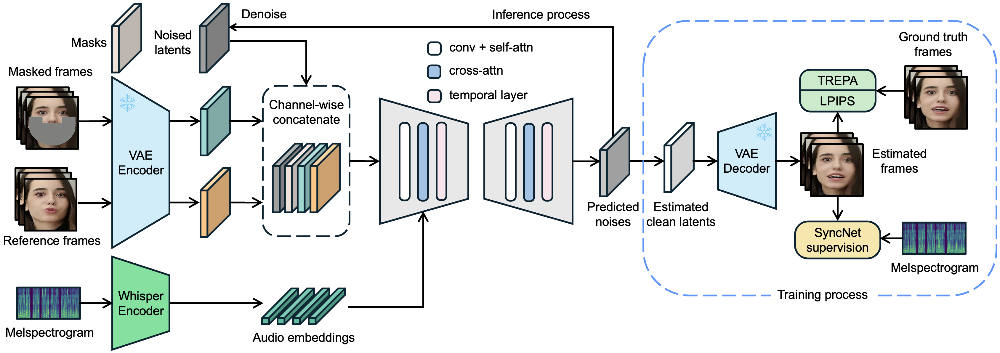

<h1 align="center">LatentSync Assignment</h1>


## 📖 Introduction

We present *LatentSync*, an end-to-end lip-sync method based on audio-conditioned latent diffusion models without any intermediate motion representation, diverging from previous diffusion-based lip-sync methods based on pixel-space diffusion or two-stage generation. Our framework can leverage the powerful capabilities of Stable Diffusion to directly model complex audio-visual correlations.

## 🏗️ Framework

<p align="center">

<p>

LatentSync uses the [Whisper](https://github.com/openai/whisper) to convert melspectrogram into audio embeddings, which are then integrated into the U-Net via cross-attention layers. The reference and masked frames are channel-wise concatenated with noised latents as the input of U-Net. In the training process, we use a one-step method to get estimated clean latents from predicted noises, which are then decoded to obtain the estimated clean frames. The TREPA, [LPIPS](https://arxiv.org/abs/1801.03924) and [SyncNet](https://www.robots.ox.ac.uk/~vgg/publications/2016/Chung16a/chung16a.pdf) losses are added in the pixel space.


(Photorealistic videos are filmed by contracted models, and anime videos are from [VASA-1](https://www.microsoft.com/en-us/research/project/vasa-1/))

## 📑 Open-source Plan

- [x] Inference code and checkpoints
- [x] Data processing pipeline
- [x] Training code

## 🔧 Setting up the Environment

Install the required packages and download the checkpoints via:

```bash
source setup_env.sh
```

If the download is successful, the checkpoints should appear as follows:

```
./checkpoints/
|-- latentsync_unet.pt
|-- whisper
|   `-- tiny.pt
```

Or you can download `latentsync_unet.pt` and `tiny.pt` manually from our [HuggingFace repo](https://huggingface.co/ByteDance/LatentSync-1.6)

## ⚡ Performance Optimizations

The following optimizations have been implemented to improve performance and reduce memory usage:

### Inference Optimizations

1. **VAE Slicing** (scripts/inference.py:90)
   - Enables VAE slicing to reduce memory consumption during encoding/decoding
   - Comes at the cost of increased number of GPU calls, but with low GPU computation time
   - Reduces inference time significantly for lower-end GPUs
   - Implementation: `pipeline.enable_vae_slicing()`

2. **Audio Embeddings Caching** (scripts/inference.py:51)
   - Caches audio embeddings to avoid redundant computation
   - Configured with cache directory: `./audio_embeds_cache`

3. **GPU Initialization** (scripts/inference.py:73)
   - Initializes model directly on GPU (CUDA) to avoid unnecessary CPU-to-GPU transfers
   - Implementation: `UNet3DConditionModel.from_pretrained(..., device="cuda")`

4. **Parallel Affine Transform** (latentsync/pipelines/lipsync_pipeline.py:368)
   - Uses `ThreadPoolExecutor` for parallel processing of video frame transformations instead of sequential transformations
   - Significantly speeds up batch face transformations
   - Faster with more cores
   - For instance, for a video of length 1 minute with audio of length 50 seconds, the affine transformations were performed in 74 seconds in the original code, which was cut done to 34 seconds by parallel processing in the optimized code

### Inference Results
These inferences were conducted on a AMD Ryzen 5 7600 6-Core Processor with a Nvidia RTX 3060 (12 GB VRAM) GPU: 
1. For the demo video `demo1_video.mp4` and `demo1_video.wav`, there was reduction by 13.7% reduction in CPU time, and 10.6% reduction in CUDA time for 15 inference steps. The SyncNet confidence remained the same at 8.27. The profiler result for optimized code and original code are [here](https://drive.google.com/file/d/1xRi9BCnKuYAVYutprncaG2wefe_KuyZt/view?usp=share_link) and [here](https://drive.google.com/file/d/1h8Pqyx0rbXLsox99RZJ_r2ehoN6NZgbC/view?usp=share_link), respectively.
2. For the demo video `demo2_video.mp4` and `demo1_video.wav`, there was reduction by 12.9% reduction in CPU time, and 10.5% reduction in CUDA time for 15 inference steps. The SyncNet confidence for original code was 7.78, and the optimized version got a score of 7.80. The profiler result for optimized code and original code are [here](https://drive.google.com/file/d/1-w48wbizctLj4Q_C9RGgYBDTdAjm25c3/view?usp=share_link) and [here](https://drive.google.com/file/d/1Q523SZlgSPJ27D6e9CVc21qYHS9-I30E/view?usp=share_link), respectively.
3. For the demo video `demo3_video.mp4` and `demo1_video.wav`, there was reduction by 13.7% reduction in CPU time, and 11.1% reduction in CUDA time for 15 inference steps. The SyncNet confidence for original code was 9.02, and the optimized version got a score of 8.93. The profiler result for optimized code and original code are [here](https://drive.google.com/file/d/1yIy8YIIMiIP6qjCXQnQ8P2Me0BWaE12H/view?usp=share_link) and [here](https://drive.google.com/file/d/12ykrCieoKZnKzqYrFxfwfQouZNnogQv5/view?usp=share_link), respectively. 
4. For a video and audio of length approx. 1 minute, there was an estimated reduction of approx. 20% in inference time for the optimized code, as opposed to the original one. The inference time for optimized code was 26 minutes and 38 seconds, and an estimated time of 32 minutes for the original code as it crashed due to VRAM constraints. The profiling could also not be conducted due to system RAM issues. The video and audio can be found [here](https://drive.google.com/file/d/1b5hSjj1yp8-QrXF0EPEF_pI_78YuiKPH/view?usp=share_link) and [here](https://drive.google.com/file/d/1fXIc6s3nP_HOHVc4RQ8OEZEV1Ybk4pmY/view?usp=share_link), respectively. The output lip-synced video can be found [here](https://drive.google.com/file/d/10UoB_Yf7dFQKr5YppZgLsD1T3LtlX9jH/view?usp=share_link). 

## 🚀 Inference

Minimum VRAM for inference:

- **8 GB** with LatentSync 1.5
- **18 GB** with LatentSync 1.6

There are two ways to perform inference:

### 1. Gradio App

Run the Gradio app for inference:

```bash
python gradio_app.py
```

### 2. Command Line Interface

Run the script for inference:

```bash
./inference.sh
```

You can try adjusting the following inference parameters to achieve better results:

- `inference_steps` [20-50]: A higher value improves visual quality but slows down the generation speed.
- `guidance_scale` [1.0-3.0]: A higher value improves lip-sync accuracy but may cause the video distortion or jitter.

## 🔄 Data Processing Pipeline

The complete data processing pipeline includes the following steps:

1. Remove the broken video files.
2. Resample the video FPS to 25, and resample the audio to 16000 Hz.
3. Scene detect via [PySceneDetect](https://github.com/Breakthrough/PySceneDetect).
4. Split each video into 5-10 second segments.
5. Affine transform the faces according to the landmarks detected by [InsightFace](https://github.com/deepinsight/insightface), then resize to 256 $\times$ 256.
6. Remove videos with [sync confidence score](https://www.robots.ox.ac.uk/~vgg/publications/2016/Chung16a/chung16a.pdf) lower than 3, and adjust the audio-visual offset to 0.
7. Calculate [hyperIQA](https://openaccess.thecvf.com/content_CVPR_2020/papers/Su_Blindly_Assess_Image_Quality_in_the_Wild_Guided_by_a_CVPR_2020_paper.pdf) score, and remove videos with scores lower than 40.

Run the script to execute the data processing pipeline:

```bash
./data_processing_pipeline.sh
```

You should change the parameter `input_dir` in the script to specify the data directory to be processed. The processed videos will be saved in the `high_visual_quality` directory. Each step will generate a new directory to prevent the need to redo the entire pipeline in case the process is interrupted by an unexpected error.

## 🏋️‍♂️ Training U-Net

Before training, you should process the data as described above. We released a pretrained SyncNet with 94% accuracy on both VoxCeleb2 and HDTF datasets for the supervision of U-Net training. You can execute the following command to download this SyncNet checkpoint:

```bash
huggingface-cli download ByteDance/LatentSync-1.6 stable_syncnet.pt --local-dir checkpoints
```

If all the preparations are complete, you can train the U-Net with the following script:

```bash
./train_unet.sh
```

We prepared several UNet configuration files in the ``configs/unet`` directory, each corresponding to a specific training setup:

- `stage1.yaml`: Stage1 training, requires **23 GB** VRAM.
- `stage2.yaml`: Stage2 training with optimal performance, requires **30 GB** VRAM.
- `stage2_efficient.yaml`: Efficient Stage 2 training, requires **20 GB** VRAM. It may lead to slight degradation in visual quality and temporal consistency compared with `stage2.yaml`, suitable for users with consumer-grade GPUs, such as the RTX 3090.
- `stage1_512.yaml`: Stage1 training on 512 $\times$ 512 resolution videos, requires **30 GB** VRAM.
- `stage2_512.yaml`: Stage2 training on 512 $\times$ 512 resolution videos, requires **55 GB** VRAM.

Also remember to change the parameters in U-Net config file to specify the data directory, checkpoint save path, and other training hyperparameters. For convenience, we prepared a script for writing a data files list. Run the following command:

```bash
python -m tools.write_fileslist
```

## 🏋️‍♂️ Training SyncNet

In case you want to train SyncNet on your own datasets, you can run the following script. The data processing pipeline for SyncNet is the same as U-Net. 

```bash
./train_syncnet.sh
```

After `validations_steps` training, the loss charts will be saved in `train_output_dir`. They contain both the training and validation loss. If you want to customize the architecture of SyncNet for different image resolutions and input frame lengths, please follow the [guide](docs/syncnet_arch.md).

## 📊 Evaluation

You can evaluate the [sync confidence score](https://www.robots.ox.ac.uk/~vgg/publications/2016/Chung16a/chung16a.pdf) of a generated video by running the following script:

```bash
./eval/eval_sync_conf.sh
```

You can evaluate the accuracy of SyncNet on a dataset by running the following script:

```bash
./eval/eval_syncnet_acc.sh
```

Note that our released SyncNet is trained on data processed through our data processing pipeline, which includes special operations such as affine transformation and audio-visual adjustment. Therefore, before evaluation, the test data must first be processed using the provided pipeline.

## 🙏 Acknowledgement

- Our code is built on [AnimateDiff](https://github.com/guoyww/AnimateDiff). 
- Some code are borrowed from [MuseTalk](https://github.com/TMElyralab/MuseTalk), [StyleSync](https://github.com/guanjz20/StyleSync), [SyncNet](https://github.com/joonson/syncnet_python), [Wav2Lip](https://github.com/Rudrabha/Wav2Lip).

Thanks for their generous contributions to the open-source community!

## 📖 Citation

If you find our repo useful for your research, please consider citing our paper:

```bibtex
@article{li2024latentsync,
  title={LatentSync: Taming Audio-Conditioned Latent Diffusion Models for Lip Sync with SyncNet Supervision},
  author={Li, Chunyu and Zhang, Chao and Xu, Weikai and Lin, Jingyu and Xie, Jinghui and Feng, Weiguo and Peng, Bingyue and Chen, Cunjian and Xing, Weiwei},
  journal={arXiv preprint arXiv:2412.09262},
  year={2024}
}
```
